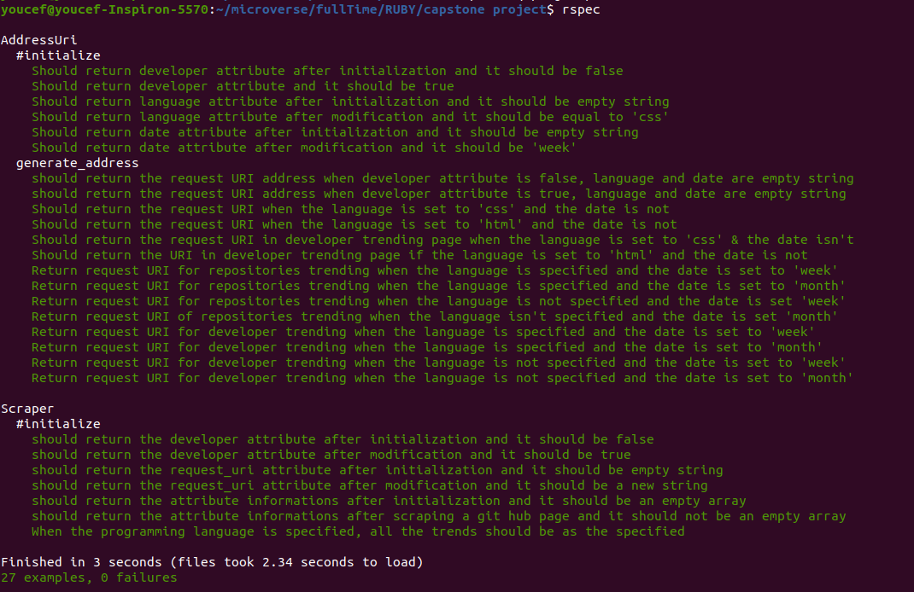

# Ruby Github trending page scraper


Microverse Ruby capstone project


In the project, we make [github trending page](https://github.com/trending) scraper using ruby language and nokogiri framework. We Give the possibility to scrap the page according the [repositories](https://github.com/trending) or [developers](https://github.com/trending/developers). We give also the option of selecting the programming language and the period (this day, ths week or this month).

## Built With

- Ruby,
- Nokogiri
- Open_uri
- Rubocop

## Live Demo

[Live Demo Link](https://repl.it/@youcefABDELLANI/githubtrendscraper#main.rb)

## Testing the game

This game was tested using [RSpec](https://rspec.info/) which is a ruby testing tool. We tested all the public methods of this project.

### Install

- In a terminal window type gem install rspec
- Once rspec install has finished, go to project directory and type rspec --init
- You will see a folder spec and a file .rspec
- Inside spec folder you'll see a spec_helper.rb file.

### Run the test
- Open a terminal window and type rspec
- All tests should be passed:



## Getting Started

To get a local copy up and running follow these simple example steps.

### Install
Besides the live demo link, you can run those functions in you own local environment. 
In order to run, you need to install RUBY in your computer. For windows you can go to [Ruby installer](https://rubyinstaller.org/) and for MAC and LINUX you can go to [Ruby official site](https://www.ruby-lang.org/en/downloads/) for intructions on how to intall it.
Then you can clone the project by typing ```git clone https://github.com/ABDELLANI-Youcef/ruby_scraper```


### Run the application
Type ```./bin/main.rb``` in the root file of the project. 
You can also type ```ruby bin/main.rb``` in the root file of the project.

### Using the application
After running the application you get welcome message. While using the application it will ask you to specify whether you would like to scrap a the repositories trending or the developers trending, the whether you would like select a particular programming language (in which case it while ask you to type it) or all the languages in general and to select if the trending are for today, this week or this month.

After scrapping the page, the application will ask you if you would like to display all the results or a a specific trending (with certain order)

Finaly, Itwill ask you if you would like to make another query and scrap the results page or to quite the application


👤 **Abdellani Youcef**

- Github: [@ABDELLANI-Youcef](https://github.com/ABDELLANI-Youcef)

- Twitter: [@YoucefAbdellani](https://twitter.com/YoucefAbdellani)

- Linkedin: [linkedin](https://www.linkedin.com/in/youcef-abdellani-b79361124/)

## 🤝 Contributing

Contributions, issues and feature requests are welcome!

Feel free to check the [issues page](issues/).

## Show your support

Give a ⭐️ if you like this project!

## Acknowledgments

- Microverse
- Odin project
